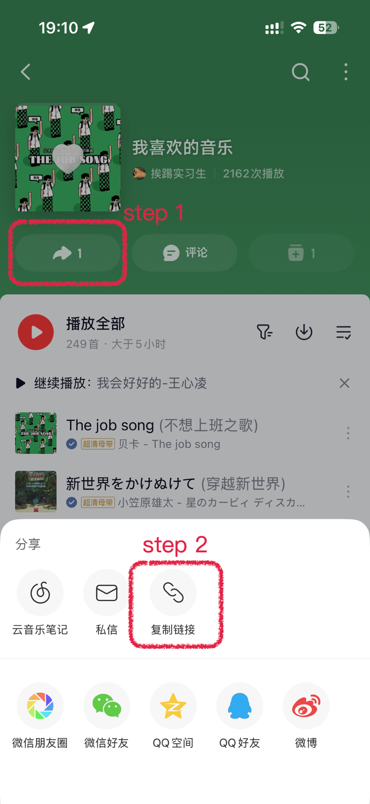

# 灵魂唱片店

通过网易云音乐歌单分析你的性格、品味与内心世界。

**在线体验：https://musicsoul.jiapan.me**

## 如何获取歌单链接

在网易云音乐 App 中，打开歌单页面，点击「分享」按钮，选择「复制链接」，然后粘贴到输入框即可。

<p align="center">
  
</p>

## 功能

- 粘贴网易云音乐歌单链接，AI 生成完整的音乐人格分析报告
- 支持多种输入格式：歌单链接、163cn.tv 短链、App 分享文本、纯数字 ID
- 分析维度：
  - 灵魂画像 — 一句话概括你的音乐人格
  - 音乐 DNA — 五维雷达图（怀旧/浪漫/叛逆/文艺/治愈）
  - 情感光谱 — 情绪分布环形图
  - 灵魂歌单 — 最能代表你的 3-5 首歌
  - MBTI 推测 — 基于歌单推断人格类型
  - 爱好猜测 — 从音乐品味推断兴趣爱好
  - 聊天攻略 — 如何与你聊天的建议
  - 内心独白 — 诗意的第二人称灵魂解读
  - 趣味标签 — 适合分享的个性标签
- 保存长图，方便分享到社交平台

## 技术栈

- **Next.js** (App Router) + **Tailwind CSS**
- **Gemini 3.1 Pro** — AI 分析引擎，结构化 JSON 输出
- **Recharts** — 雷达图、环形图可视化
- **modern-screenshot** — 长图导出
- 部署于 **Vercel**

## 本地开发

```bash
# 安装依赖
npm install

# 配置环境变量
cp .env.local.example .env.local
# 编辑 .env.local，填入你的 Gemini API Key

# 启动开发服务器
npm run dev
```

打开 http://localhost:3000 即可使用。

## 环境变量

| 变量名 | 说明 |
|--------|------|
| `GEMINI_API_KEY` | Google Gemini API 密钥 |

## 部署

推送到 GitHub 后，在 Vercel 导入仓库，设置 `GEMINI_API_KEY` 环境变量，即可自动部署。每次 push 到 master 分支会触发自动构建。
